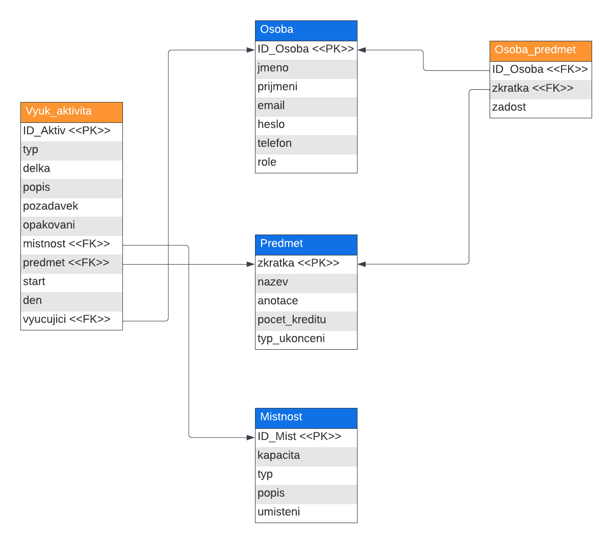

# IS pro plánování rozvrhů
	
## Autoři

* Jonáš Morkus (modelování databáze, implementace views, controllers, services, video)
* Ondřej Lukášek (implementace views, controllers, services, stylování, dokumentace)
* Ondřej Koumar (implementace views, controllers, services, Doxygen komentáře, kolize rozvrhu)

## Uživatelé systému pro testování

| Email             | Heslo     | Role                                         |
|-------------------|-----------|----------------------------------------------|
| admin@admin.admin | admin     | Administrátor                                |
| ucitel@ucitel.uc  | vyucujici | Vyučující (garant nějakého předmětu)         |
| vyuc@vyuc.vyuc    | vyucujici | Vyučující (negarantuje žádný předmět)        |
| rozv@rozv.rozv    | rozvrhar  | Rozvrhář                                     |
| stud@stud.stud    | student   | Student                                      |
| -                 | -         | Neregistrovaný uživatel ("Vstoupit bez přihlášení" na login stránce) |

### Video

[Odkaz na video na Sharepointu](https://vutbr-my.sharepoint.com/:v:/g/personal/xmorku03_vutbr_cz/ETpLcjTg8AJElAXixU67QP0BhePgdCRaUbnNRd3frzAEhQ?nav=eyJyZWZlcnJhbEluZm8iOnsicmVmZXJyYWxBcHAiOiJPbmVEcml2ZUZvckJ1c2luZXNzIiwicmVmZXJyYWxBcHBQbGF0Zm9ybSI6IldlYiIsInJlZmVycmFsTW9kZSI6InZpZXciLCJyZWZlcnJhbFZpZXciOiJNeUZpbGVzTGlua0RpcmVjdCJ9fQ&e=jjpjcl)

## Implementace

Projekt jsme se snažili rozdělit do 3 vrstev:

* Views - Vizuální stránka informačního systému, vykresluje data z Controllers a do nich posílá data z formulářů,
* Controllers - předávají data mezi Services a Views,
* Services - pokládají dotazy a úkoly databázi.

Projekt je vypracován bez využití frameworků (typu Laravel, Symfony, apod.).
Na komunikaci s databází bylo využito PDO.
Pro frontend bylo využito jazyka CSS, opět bez žádných frameworků (typu Bootstrap), ale byl psán ručně.

Jednotlivé případy užití jsou organizovány podle složek.
To znamená, že například o správu místností se stará pro views složka *views/room_views*,
pro services skript *services/room_service.php*,
a nakonec pro controllers složka *controllers/room_controllers*.
Velmi obdobně je tomu tak i se správou osob, předmětů a výukových aktivit.

Trochu jinak však funguje systém pro zobrazování rozvrhů, jejich řazení, systém zobrazování žádostí, a podobně.
Tyto funkcionality jsou totiž často využívané ve spojitosti s vícero tabulkami nebo spojovacími tabulkami.
Z těch se dále vyčítá více údajů z jiných tabulek prostřednictvím cizích klíčů (v diagramu označeny &lt;&lt;FK&gt;&gt;),
které vždy směřuji na primární klíče jiných tabulek (označeny &lt;&lt;PK&gt;&gt;) a
díky tomu jednoznačně identifikují daný řadek odkazované tabulky.

Mezi nejpodstatnější funkce se řadí *loadActivity($ID)* nebo funkce ve scriptu *schedule_controller.php*.
Bez nich by nebylo možné pořádně zobrazit rozvrh nebo s ním manipulovat (filtrovat si jednotlivé dny, apod.).

Další důležitou součástí jsou scripty pro manipulaci s osobami (mazání, vytváření, úprava, načítání seznamu uživatelů).

Všechna potřebná pole ve formulářích jsou zasílána převážně metodou **post**.
Je to z důvodu, že při posílání velkého množství informací by URL adresa vypadala velmi nevzhledně.
Metodou **get** si posíláme například jednorázové zprávy nebo příznaky nějaké akce (chybové kódy, krátká ID).
Vyplnění jednotlivých políček formulářů je kontrolováno za pomocí Javascriptu (*/public/validateForm.js*).
V něm jsou nastavena povinná pole formuláře.
Při odeslání formuláře se funkce spustí a zkontroluje vyplnění všech povinných polí.
Nevyplněná povinná pole jsou následně ohraničena červeným rámečkem, aby bylo jasně vidět,
která políčka ještě musí uživatel vyplnit.

### Databáze

Databázi si je možné prohlédnout v SQL kódu ve složce *misc/database.sql*.
Součástí kódu této databáze jsou příkazy pro vložení samplových dat.

## Instalace

### Softwarové požadavky

Celý informační systém je otestován na serveru EVA (eva.fit.vutbr.cz).
V praxi byl informační systém vyvíjen v Docker containerech (MySQL Server a Apache).
Informační systém je tedy funkční a otestovaný na následujícím softwaru.

**Apache webový server**

* PHP 8.2 (Docker)
* PHP 8.1.25 (EVA)

**MySQL databázový server**

* Verze 8.2.0 (Docker)
* Verze 5.7.42 (EVA)

### Postup instalace na server

Jako první je potřeba si zařídit a nainstalovat webový a databázový server (jejich specifikace jsou výše).
Do kořenového adresáře Vašeho webového serveru je následně potřeba umístit obsah archivu, odevzdaného týmem xmorku03.
Pro ověření, že jste jej umístili na správné místo si můžete zobrazit ve Vašem webovém prohlížeči URL vašeho webového serveru.
Pokud se Vám zobrazí přihlašovací stránka (bez jakékoliv stylizace), jsou zdrojové soubory umístěny správně.

Nyní je ještě potřeba nastavit správně cestu ke CSS stylovému souboru a k Javascipt skriptu pro kontrolu vyplněnosti formulářů.
Pro její nastavení prosím běžte do souboru *common.php* do funkce *make_header()*.
Zde je potřeba nastavit hodnotu proměnné *$domain* na URL vašeho webového serveru místo aktuálního *'http://localhost:8080'*.
Je to z důvodu, že soubory je potřeba mít dostupné z mnoha kontextů informačního systému a na serveru EVA,
není kořenový adresář webového serveru nastaven na adresář studenta.

Po nastavení hodnoty proměnné je dobré si vyzkoušet, zdali byla nastavená správně.
Pokud se Vám při otevření URL webového serveru ve vašem prohlížeči nezobrazí přihlašovací stránka, obsahující stylování,
potom může být ještě chyba v cache vaše prohlížeče, který si vaši stránku uložil.
Pokuste se vyčistit cache vašeho prohlížeče pro URL webového serveru a URL serveru znova otevřete.

Pokud se ani nyní nevykresluje stylizovaná přihlašovací stránka, je chyba v nastavení proměnné *$domain*.
Zkuste ji znovu nastavit a zopakovat předchozí postup.
Při správném nastavení proměnné se styl načte.

### Nastavení databáze

Pokud jste si vyzkoušeli přihlášení nebo jenom vstoupit bez přihlášení, všimli jste si, že vás systém nepřihlásil nebo nevypsal anotace předmětů.
To je z důvodu nenastaveného databázového serveru. Proto bude potřeba následující:

* Nastavení PDO připojení,
* Spuštění SQL skriptu (nahrání tabulek a sample dat).

Nyní je potřeba si zjistit **adresu databázového serveru**, **jméno uživatele databázového serveru** a **heslo uživatele databázového serveru**.

Pokud máte všechny tyto údaje, otevřete si soubor *db_conn_parameters.php* ve složce *misc*.
Zde doplňte vaše zjištěné údaje do proměnných *$connString*, *$userName*, *$password*.
Údaje doplňte tak aby:

* proměnná *$connString* obsahovala adresu databázového serveru,
* proměnná *$userName* obsahovala jméno uživatele databázového serveru,
* proměnná *$password* obsahovala heslo uživatele databázového serveru.

Nyní je nastaveno PDO připojení k databázi a je potřeba pouze naplnit Vaši databázi tabulkami a ukázkovými daty.
Pro to doporučujeme se připojit k vaší databázi nějakého nástroje. Námi testované nástroje jsou například
[JetBrains Datagrip](https://www.jetbrains.com/datagrip/), [MySQL Workbench](https://www.mysql.com/products/workbench/)
nebo webový klient (pokud jej máte nastavený) [phpMyAdmin](https://www.phpmyadmin.net/).

Nyní si okopírujte obsah souboru *database.sql* ze složky *misc* do vašeho zvoleného klienta a skript spusťte.
Pokud skript proběhl bez potíží, je vše zařízeno a můžete se přihlásit a začít používat informační systém.

Pokud se při spuštění skriptu vyskytly komplikace, je možné, že užíváte nekompatibilní verzi MySQL nebo máte
špatně nastavený nástroj pro spouštění skriptu.
Ověřte si správnost vašeho nastavení a verzi SQL a opakujte postup.

Pokud skript proběhl bez potíží, ale nevidíte stále žádná data a nemůžete se přihlásit, je zřejmě špatné nastavení PDO připojení.
Zkuste si ověřit správnost Vašich zadaných dat a postup znovu opakujte.

Nyní by měl být informační systém kompletně funkční.

## Známé problémy

Systém implementuje všechny body zadání, ale nicméně se najdou drobnosti, které lehce kazí použitelnost.
Například filtrování osob podle jejich role nebo filtrování místností podle jejich atributů, a podobně.
